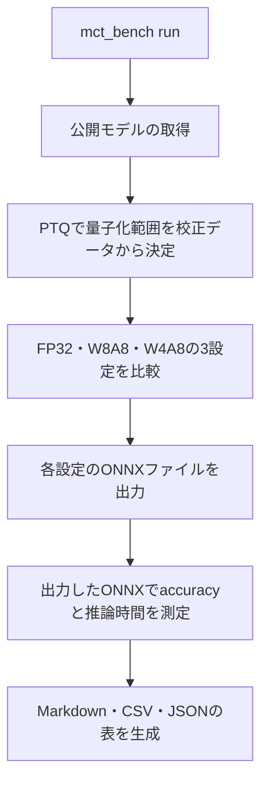
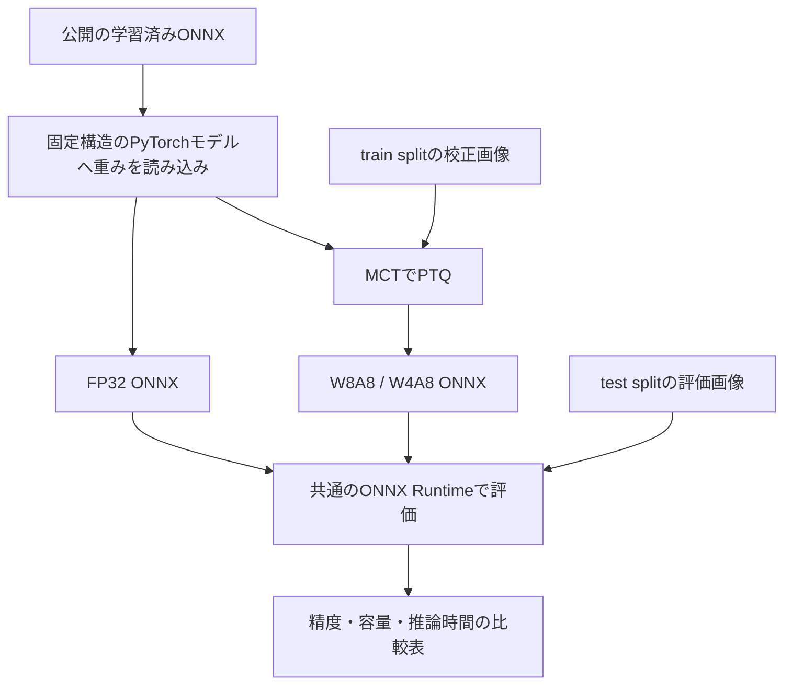

Sony Semiconductor Solutionsの[Model Compression Toolkit（MCT）](https://github.com/SonySemiconductorSolutions/mct-model-optimization)を使い、量子化前後の**精度・モデル容量・推論時間を1枚の表にまとめるCLI**を作りました。

公開の学習済みモデルに8bitと4bitの量子化を適用し、Fashion-MNISTのtest split全10,000画像で評価しました。W4A8（重み4bit・活性値8bit）のaccuracyは94.76%から94.22%へ変化。ONNXファイルの容量は、減るどころか約0.18%増えました。

なぜ4bitにしてファイルサイズが増えたのかは、「4bitでもONNXの容量が減らなかった理由」の章で説明します。

この結果を理解する鍵は、**値を何bitの精度に丸めるかと、その値を何bitで保存するか**を分けることです。

設定値を信じず、完成したファイルを測る。理論値と完成物の落差を、毎回の検証の規律として扱う。量子化に限らず、自分が作るものすべてに当てている物差しです。この記事では実測結果を起点に、MCTから標準ONNXへの出力、比較条件の揃え方、再現用CLIの設計を紹介します。

## 1コマンドで、量子化前後を比較する

流れを図にすると、次のようになります。



作成した`mct-bench`は、公開モデルの取得からPTQ、ONNXへの出力、評価、表の生成までを実行します。

```bash
python -m mct_bench run --output runs/full
```

PTQはPost-Training Quantizationの略です。学習済みモデルの重みや活性値を、少ない段階の数値で表せるようにします。今回は校正用データから量子化の範囲を決め、再学習や微調整は行いません。

既定で比較するのは次の3設定です。

| 設定 | 重みの精度 | 活性値の精度 |
| --- | ---: | ---: |
| FP32 | 32bit浮動小数点 | 32bit浮動小数点 |
| W8A8 | 8bit | 8bit |
| W4A8 | 4bit | 8bit |

活性値は、層から次の層へ渡す途中の計算結果です。**この記事の「4bit」は、重み4bit・活性値8bitのW4A8を指します。** バイアスはFP32のままです。

素材にはFashion-MNISTと、`tsilva/fashionmnist-classifier-cnn`の公開学習済みONNXを使いました。このモデルは6個のConvと1個のLinearを持つCNNです。10クラス分類なので、精度指標にはtop-1 accuracyを採用しています。

出力は、設定を横に並べたMarkdownとCSV、丸め前の数値や測定条件を収めたJSON、各設定のONNXファイルです。**accuracyも推論時間も、実際に出力したONNXを使って測ります。**

## 10,000画像での実測結果

校正には公式train splitから選んだ512画像、精度評価には公式test splitの全10,000画像を使いました。以下は2026年9月17日にApple M3 Proで測定した結果です。

| 指標 | FP32 | W8A8 | W4A8 |
| --- | ---: | ---: | ---: |
| Accuracy | 94.76% | 94.76% | 94.22% |
| FP32からの精度差 | — | 0.00 pp | −0.54 pp |
| ONNXファイル容量 | 4,590,949 bytes | 4,599,177 bytes | 4,599,177 bytes |
| 容量の変化率 | — | +0.18% | +0.18% |
| 推論時間・中央値 | 3.992 ms | 4.043 ms | 4.046 ms |
| 推論時間の変化率 | — | +1.27% | +1.35% |
| 推論時間・p90 | 4.179 ms | 4.237 ms | 4.200 ms |
| 推論時間・標準偏差 | 0.172 ms | 0.109 ms | 0.123 ms |

出典：[実測JSON](https://github.com/hocky0301/mct-bench/blob/v0.1.0/examples/full/results.json)、[CLIが生成した全項目の比較表](https://github.com/hocky0301/mct-bench/blob/v0.1.0/examples/full/comparison.md)。時間はbatch size 1の1回の推論です。

精度差の単位`pp`はpercentage pointsです。94.76%から94.22%への変化は、両者を引いて−0.54 ppと表します。容量と時間の変化率は`100 × (量子化後 / FP32 − 1)`で、負なら減少、正なら増加です。

W8A8ではaccuracyが同じでした。ただし、同じ正解率でも、個々の画像の予測まで一致したとは限りません。W4A8では全体の正解数が9,476件から9,422件へ減りました。

### 推論時間から、どこまで言えるか

時間は各モデル100回測り、表には中央値・p90・標準偏差を載せています。p90は、測定値の90%がその時間以下に収まる点です。

測定環境はApple M3 Pro、macOS 26.5、Python 3.12.14。他の作業も動く共有ホストで、計測直前のload average（1分/5分/15分）は8.09 / 6.17 / 4.74でした。電源設定・温度・他プロセスを制御していないため、今回の小さな差から有意な速度差は主張できません。

また、全設定でONNX Runtimeのグラフ最適化を無効にしています。この表が示すのは、**出力したグラフを同じCPU実行条件で動かしたときの時間**です。低ビット専用カーネルや製品向けの実行環境による高速化を測った結果ではありません。

## 4bitでもONNXの容量が減らなかった理由

今回選んだMCTの出力形式は、`FAKELY_QUANT`です。この経路では量子化後の重みの値をfloat32で保存し、活性値には`QuantizeLinear`／`DequantizeLinear`を使います。[MCTの重みexport実装](https://github.com/SonySemiconductorSolutions/mct-model-optimization/blob/v2.6.0/model_compression_toolkit/exporter/model_exporter/pytorch/base_pytorch_exporter.py)

量子化後の重みは、概念的には次のように表せます。

```text
量子化後の重みの値 ≈ 整数の段階値 × スケール
```

W4A8では、チャンネルごとのスケールに対して、重みが取る段階は最大16段階になります。しかし「段階値×スケール」で得た値をfloat32に入れて保存すれば、ファイル上では1要素あたり32bitを使います。

たとえば、ある値を`0.5`に丸めた後、`float32(0.5)`として保存するイメージです。値は丸められていても、保存用の型はfloat32のままです。

実際のONNXを調べると、重みを含むinitializer（ONNXグラフ内で重みなどの定数を保持する要素）はすべてfloat32でした。W8A8とW4A8は重みの形状も追加する演算の構成も同じで、どちらも4,599,177 bytesです。量子化用の演算と定数が加わり、FP32からは**8,228 bytes増加**しました。[保存型・演算数・容量の検査記録](https://github.com/hocky0301/mct-bench/blob/v0.1.0/examples/full/results.json)

今回の結果は、次の3項目を合わせると読み取れます。

| 確認するもの | 今回の構成 |
| --- | --- |
| 数値の量子化精度 | W8A8／W4A8 |
| 重みのファイル上の保存型 | float32 |
| 実行環境 | ONNX Runtime、CPU、グラフ最適化なし |

そこでCLIでは、設定したビット幅から理論的な容量を計算して埋めるのではなく、**完成したONNXファイル全体のbytesを測る**ようにしました。量子化の設定名と、配布するファイルの実態を一緒に記録するためです。

## MCTから標準ONNXまでをつなぐ

処理は次の順に進みます。



MCTへ渡すPyTorchモデルは、ローカルに定義した固定構造のCNNです。公開ONNXにある重み定数を読み込むアダプターを用意し、元ONNXとの出力を照合します。ダウンロードしたPythonコードやpickleのcheckpointは実行しません。この部分は選んだモデル専用で、任意のONNXを変換する汎用コンバーターではありません。

### export形式を明示する

MCT 2.6.0の既定の量子化export形式は`MCTQ`です。今回は標準ONNX Runtimeで扱える演算を使うため、`FAKELY_QUANT`を明示しました。[MCT export API](https://github.com/SonySemiconductorSolutions/mct-model-optimization/blob/v2.6.0/model_compression_toolkit/exporter/model_exporter/pytorch/pytorch_export_facade.py)

主要部分は以下です。`quantized_model`はPTQ後のモデル、`representative_data_gen`は校正batchを1要素のリストに包んでyieldする関数です。MCTは繰り返し呼び出すため、毎回新しいイテレーターを返す必要があります。

```python
import model_compression_toolkit as mct

mct.exporter.pytorch_export_model(
    model=quantized_model,
    save_model_path=str(path),
    repr_dataset=representative_data_gen,
    serialization_format=(
        mct.exporter.PytorchExportSerializationFormat.ONNX
    ),
    quantization_format=mct.exporter.QuantizationFormat.FAKELY_QUANT,
    onnx_opset_version=17,
)
```

出力後にはONNX checkerで検査し、独自ドメインの演算や外部の重みファイルが含まれていないことも確認します。容量を測る対象は、重みまで含む自己完結した1つのONNXです。

### 指定したビット幅を、PTQ後にも調べる

MCTのTPC（Target Platform Capabilities）は、演算ごとに利用できる量子化設定を記述します。今回はMCT同梱の演算マッピングを利用し、重みを8bitまたは4bitに固定しました。この変更で特定のエッジデバイスに対応すると検証したわけではありません。

さらにPTQ後の量子化器を調べ、6個のConvと1個のLinearがすべて指定した重みのビット幅になっていることを確認します。活性値の量子化器9個も8bitです。指定と異なるビット幅があれば、成功の表を出す前に停止します。

**W4A4は、このCLIでは受け付けません。** 固定したPyTorch 2.6の標準ONNX exporterが4bit活性値の量子化範囲に対応しないためです。これはONNX全般の制約ではなく、今回選んだ出力経路の制約です。[PyTorchの該当実装](https://github.com/pytorch/pytorch/blob/v2.6.0/torch/onnx/symbolic_opset13.py)

## 比較表を成立させるための測定条件

### 校正と評価を分け、全設定で同じ画像を使う

校正用の512画像はtrain splitから選び、accuracyを計算する10,000画像はtest splitを使います。乱数seedは42に固定し、使った画像のindexを保存します。各設定には元の学習済みモデルから独立にPTQを適用するので、ある量子化結果をさらに量子化することはありません。

前処理は公開元に合わせ、以下の計算後に`[batch, 1, 28, 28]`の配列にします。[公開モデルカード](https://huggingface.co/tsilva/fashionmnist-classifier-cnn/blob/8b068e4063f2b03ea91651b0fa5877550616d6ae/README.md)

```python
x = (pixels.astype(np.float32) / 255.0 - 0.2860) / 0.3530
```

### 推論時間を同じ実行経路で測る

全モデルに`CPUExecutionProvider`を使い、ONNX Runtimeの設定を揃えます。

```python
options.intra_op_num_threads = 1
options.inter_op_num_threads = 1
options.execution_mode = ort.ExecutionMode.ORT_SEQUENTIAL
options.graph_optimization_level = ort.GraphOptimizationLevel.ORT_DISABLE_ALL
```

CPUの同期的な`session.run`を`perf_counter_ns`で囲みます。Pythonからの呼び出しは含め、モデル読み込み、前処理、PTQ、export、ウォームアップは計測区間から外します。

各モデルを20回ウォームアップしてから100回ずつ測定します。準備済みの16個の入力batchを循環させ、各回で全モデルに同じ入力を渡します。モデル順は毎回ランダムに入れ替えます。実行順による偏りを減らしつつ、残るばらつきを見られるよう、生の100サンプルも保存します。[時間計測の実装](https://github.com/hocky0301/mct-bench/blob/v0.1.0/mct_bench/measurement.py)

### 出力照合の許容差にも根拠を持たせる

実装中、ONNX Runtimeの最適化を有効にすると、PyTorchとの出力差が量子化の刻みを複数またぐケースがありました。全設定を`ORT_DISABLE_ALL`に揃えたのはこのためです。

それでも浮動小数点の丸めが量子化の境界をまたぐと、出力値が1段階変わることがあります。そこで、FP32とPTQ後では照合の許容差を分けました。

| 照合対象 | 許容差 |
| --- | --- |
| 元ONNXと再構成したPyTorch、FP32再export | `atol=1e-4`、`rtol=1e-4` |
| PTQ後のPyTorchとONNX | 最終出力の量子化刻み＋`1e-5`、`rtol=0` |

照合には最大32枚の評価画像を使います。この画像を量子化の校正値の探索には渡しません。許容差を超えれば成功の表を生成せず停止します。

今回のPTQモデルでは最終出力の刻みと観測した最大差がともに`0.0625`で、照合した32枚の予測クラスは一致しました。この検査は、全入力での完全一致を証明するものではありません。記事のaccuracyは、照合後にONNXで評価した全10,000枚から算出しています。[出力照合の記録](https://github.com/hocky0301/mct-bench/blob/v0.1.0/examples/full/results.json)

## 公開データ・モデルのライセンスを残す

素材は、公開元が商用利用・再配布を許すライセンスを示しているものから選びました。

| 素材 | 配布元のライセンス表記 | 根拠 |
| --- | --- | --- |
| Fashion-MNIST | MIT | [ZalandoのLICENSE](https://github.com/zalandoresearch/fashion-mnist/blob/b2617bb6d3ffa2e429640350f613e3291e10b141/LICENSE) |
| `tsilva/fashionmnist-classifier-cnn`の学習済みONNXと構造参照 | モデルカードでMITを宣言 | [固定revisionのモデルカード](https://huggingface.co/tsilva/fashionmnist-classifier-cnn/blob/8b068e4063f2b03ea91651b0fa5877550616d6ae/README.md) |
| MCT 2.6.0 | Apache-2.0 | [MCTのLICENSE](https://github.com/SonySemiconductorSolutions/mct-model-optimization/blob/v2.6.0/LICENSE.md) |

モデルのリポジトリには独立したLICENSEファイルがなく、根拠はモデルカードのMIT宣言です。この点を一覧に明記し、モデルカードとMITの条文を同梱しました。再配布するONNXにも対応するライセンス表示を添えます。

データとモデルはrevision・SHA-256・ファイル長を固定し、取得時に照合します。このCLI自体は閲覧用に公開していて、利用は許可制です（リポジトリのLICENSE）。Python依存ライブラリにはそれぞれのライセンスが適用されます。[素材の一覧と表示義務](https://github.com/hocky0301/mct-bench/blob/v0.1.0/THIRD_PARTY_LICENSES.md)

## 再現する

Python 3.12を使います。以下はリポジトリへのアクセス権がある場合、またはpublicへの切り替え後の手順です。測定に対応するコードを固定するため、検証済みのcommitへcheckoutします。

```bash
git clone https://github.com/hocky0301/mct-bench.git
cd mct-bench
git checkout v0.1.0

python3.12 -m venv .venv
source .venv/bin/activate
python -m pip install pip==25.0.1
python -m pip install -r requirements.txt
python -m pip check

python -m mct_bench run --output runs/reproduce
```

MCT 2.6.0、PyTorch 2.6.0、ONNX 1.17.0、ONNX Runtime 1.21.0などを、間接依存も含めて`requirements.txt`で固定しています。初回は約35.5 MBの公開素材を取得します。既存の結果は上書きしないので、実行ごとに新しい出力先を指定してください。

```text
runs/reproduce/
├── comparison.md
├── comparison.csv
├── results.json
├── sample-indices.json
├── run-status.json
├── assets_manifest.json
├── THIRD_PARTY_LICENSES.md
├── licenses/
└── models/
    ├── fp32.onnx
    ├── w8a8.onnx
    └── w4a8.onnx
```

結果JSONにはCPU、OS、依存バージョン、thread数、計測前後のload averageも入ります。seedの固定は入力選択などの再現に使いますが、異なるCPUや電源状態で同じ推論時間になることを保証するものではありません。

### 設定を増やして横に並べる

重みのbit幅は、次のように指定できます。

```bash
python -m mct_bench run --bits 8 4 --output runs/bits
```

閾値の決め方やbias correctionを変える場合は、JSONを使います。たとえば次の内容を`variants.json`として保存します。

```json
{
  "variants": [
    {"name": "w8a8", "weights_bits": 8},
    {"name": "w4a8", "weights_bits": 4},
    {
      "name": "w4a8-no-bias",
      "weights_bits": 4,
      "bias_correction": false
    }
  ]
}
```

```bash
python -m mct_bench run --config variants.json --output runs/settings
```

`error_method`には`mse`と`no_clipping`を指定できます。前者は量子化誤差の二乗平均を基準に閾値を探し、後者は観測した値域を基準に閾値を決める設定です。設定を追加すると比較表の列が増えます。本文の全10,000画像の結果は、既定の3設定を測ったものです。

### 自動テストを実行する

素材取得を含めて検査するコマンドです。

```bash
python -m mct_bench prepare --cache .cache/mct-bench
MCT_BENCH_CACHE="$PWD/.cache/mct-bench" python -m pytest -q
```

ローカルでは91件のテストが成功しました。指定ビット幅、重みの量子化刻み、校正・評価データの分離、端数batch、差分の符号、ウォームアップを除いた計測回数などを検査します。

GitHub Actionsでも、macOS・Linuxの両方で、依存のインストールから公開素材の取得、4種類のPTQ設定、ONNXと各レポートの出力までを同じ手順で実行する設定にしています。結果はリポジトリのActionsタブに残ります。

CIの評価画像数は小さくしてあります。Linuxで一連の処理が通ったことは確認していますが、掲載した全件評価と時間の表はmacOSで得た結果です。

## 作ってみて

W4A8では容量が8,228 bytes増え、精度は94.76%から94.22%に下がりました。4bitまで落とせば小さくなるはずだという思い込みは、実測してみると違っていました。

この作業で肝になったのは、量子化そのものより、比べる条件をそろえるところでした。同じ画像、同じ経路、同じ最適化設定。最適化を有効にしたまま比べると出力差が量子化の刻みを複数またぐことがあり、そこをそろえて初めて、表の数字を自分の数字として言えるようになりました。

次に確かめたいのは、この表がそのまま通用しない場所です。保存形式やランタイムが変わる実機で、同じ手順で同じ表を作れるかどうかから見直すつもりです。

## まとめ

MCTによるPTQから、精度・ONNX容量・CPU推論時間の比較までを1つのCLIにまとめました。今回のW4A8ではaccuracyが0.54 pp下がり、ONNX容量は約0.18%増えました。

この容量の結果は、量子化した重みの値をfloat32で保存する出力形式によるものです。ビット幅の設定を変えた効果を読むには、**数値の精度・保存するデータ型・実行するランタイム**をセットで確認する必要があります。

次に低ビットの保存形式や対応ランタイムを試すときも、同じ評価画像と測定手順を使えば比較を続けられます。今回実装した範囲は標準ONNXへのexportとホストCPU上の評価までです。TFLiteへの変換やエッジデバイス固有の変換・書き込みは含めていません。

設定名から効果を期待するだけでなく、完成したファイルを測り、改善しなかった結果も残す。そのための比較表を自動で作れるようにしたのが、このCLIです。

今回作ったのは、「4bitなら小さくなるはず」という期待を、accuracy・ファイル全体のbytes・推論時間の実測で確かめるためのCLIです。改善しなかった結果もそのまま出す設計にしました。ビット幅の数字だけでなく、数値の精度・保存形式・実行環境をセットで見る。それが、この実装から自分が持ち帰ったことです。
